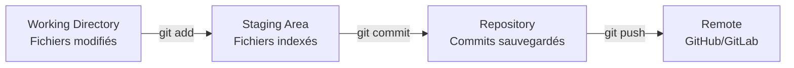
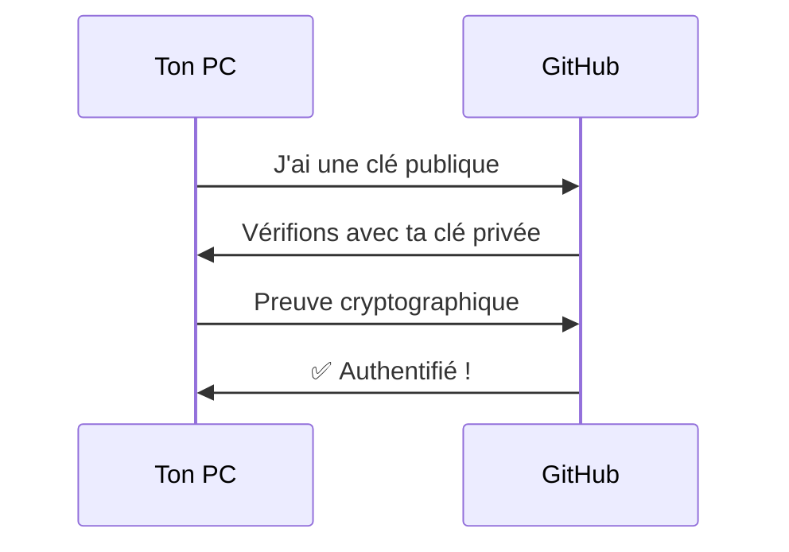

# 📚 **Guide Complet : Git, GitHub, SSH, CI/CD**

> *De débutant à professionnel - Tout ce que tu dois maîtriser*

---

## 📑 **Table des matières**
1. [Concepts fondamentaux](#-partie-1-concepts-fondamentaux)
2. [Git : Le système de contrôle de version](#-partie-2-git-les-bases)
3. [GitHub : La plateforme collaborative](#-partie-3-github-la-plateforme)
4. [SSH : Connexion sécurisée](#-partie-4-ssh-connexion-sécurisée)
5. [CI/CD : Intégration et déploiement continus](#-partie-5-cicd)
6. [Workflows professionnels](#-partie-6-workflows-pro)
7. [Fiches pratiques](#-partie-7-fiches-pratiques)

---

## 🎯 **Partie 1 : Concepts Fondamentaux**

### **Quelle est la différence entre Git et GitHub ?**

| Aspect | **Git** | **GitHub** |
|--------|---------|------------|
| **Nature** | Logiciel (outil) | Service web (plateforme) |
| **Fonction** | Gérer les versions en local | Héberger du code en ligne + collaborer |
| **Installation** | Sur ton ordinateur | Accessible via navigateur |
| **Dépendance** | Fonctionne sans Internet | Nécessite Git pour fonctionner |
| **Créateur** | Linus Torvalds (2005) | Microsoft (rachat 2018) |

**Analogie :**
- **Git** = Microsoft Word (logiciel pour écrire)
- **GitHub** = Google Drive (plateforme pour stocker et partager les documents Word)

---

## 🔧 **Partie 2 : Git - Les Bases**

### **Niveau 1 : Débutant (les 6 commandes essentielles)**

#### **1. Configuration initiale**
```bash
# Configurer ton identité (obligatoire pour les commits)
git config --global user.name "Ton Nom"
git config --global user.email "ton@email.com"

# Vérifier la configuration
git config --list
```

#### **2. Cycle de vie d'un fichier**



**Commandes correspondantes :**
```bash
# Voir l'état de tes fichiers
git status                    # Que s'est-il passé depuis le dernier commit ?

# Ajouter à la staging area
git add fichier.txt           # Ajouter un fichier spécifique
git add .                     # Ajouter TOUS les fichiers modifiés
git add *.js                  # Ajouter tous les fichiers .js

# Sauvegarder (commit)
git commit -m "Message descriptif"
git commit -m "fix: correction du bug de login"  # Convention recommandée

# Voir l'historique
git log                       # Historique complet
git log --oneline             # Version condensée
git log --graph --all         # Vue graphique des branches
```

---

### **Niveau 2 : Intermédiaire (branches et collaboration)**

#### **3. Les branches - Concept fondamental**

**Qu'est-ce qu'une branche ?**
C'est une **ligne de développement indépendante**. Imagine que tu écris un livre :
- `main` = version publiée du livre
- `nouveau-chapitre` = brouillon du nouveau chapitre (tu peux expérimenter sans toucher au livre principal)

```bash
# Créer une branche
git branch feature-x         # Crée la branche
git checkout feature-x       # Va sur cette branche
# OU les deux en une commande :
git checkout -b feature-x    # Crée ET va sur la branche

# Travailler avec les branches
git branch                   # Voir toutes les branches locales
git branch -a                # Voir aussi les branches distantes
git switch main              # Revenir sur main (version moderne)
git checkout main            # Revenir sur main (version classique)
```

#### **4. Fusionner (merge) et Rebaser (rebase)**

**Merge vs Rebase : Le grand débat**

```bash
# MERGE : Fusionne deux branches en gardant l'historique
git checkout main
git merge feature-x          # Intègre feature-x dans main

# REBASE : Réécrit l'historique pour le linéariser
git checkout feature-x
git rebase main              # Rejoue tes commits par-dessus main
```

**Quand utiliser quoi ?**

| Situation | Merge | Rebase |
|-----------|-------|--------|
| Branche publique (partagée) | ✅ | ❌ JAMAIS |
| Branche privée (locale) | ✅ | ✅ |
| Garder un historique précis | ❌ | ✅ |
| Éviter les conflits futurs | ❌ | ✅ |

#### **5. Résoudre les conflits**

```bash
# 1. Quand un conflit survient après un merge/rebase
git status                   # Voir les fichiers en conflit

# 2. Éditer les fichiers (cherche >>>>, =====, <<<<)
# Supprime les marqueurs et garde le code voulu

# 3. Marquer comme résolu
git add fichier_résolu.txt
git commit -m "Résolution du conflit"
```

---

### **Niveau 3 : Avancé (puissance et productivité)**

#### **6. Stash - Mettre de côté temporairement**

```bash
# Scénario : Tu travailles sur un bug urgent mais tu as des modifs en cours
git stash                    # Cache toutes les modifications
git stash pop                # Récupère les modifications cachées
git stash list               # Voir tous les stashs
git stash apply stash@{1}    # Appliquer un stash spécifique
```

#### **7. Cherry-pick - Voler des commits**

```bash
# Prendre UN commit spécifique d'une autre branche
git log --oneline feature-x  # Trouver le hash du commit voulu
git checkout main
git cherry-pick a1b2c3d      # Applique SEULEMENT ce commit
```

#### **8. Reset et Revert - Revenir en arrière**

```bash
# SOFT RESET : Garde les modifications en staging
git reset --soft HEAD~1      # Annule le dernier commit, fichiers conservés

# HARD RESET : Supprime TOUT définitivement ⚠️ DANGER
git reset --hard HEAD~1      # Retour à l'état du commit précédent

# REVERT : Crée un nouveau commit qui annule (plus sûr)
git revert a1b2c3d           # Annule le commit spécifique
```

#### **9. Git Bisect - Trouver un bug par dichotomie**

```bash
git bisect start             # Commencer la recherche
git bisect bad               # La version actuelle a le bug
git bisect good v1.0         # La version v1.0 fonctionnait
# Git va checker un commit au milieu, teste-le
git bisect good/bad          # Continue jusqu'à trouver le commit fautif
git bisect reset             # Terminer la session
```

---

## 🌐 **Partie 3 : GitHub - La Plateforme**

### **Fonctionnalités essentielles**

#### **1. Pull Request (PR)**
Le cœur de la collaboration sur GitHub :

```bash
# Workflow typique
1. Forker un repo (via l'interface GitHub)
2. Cloner ton fork en local
   git clone git@github.com:TON_USERNAME/le-repo.git
3. Créer une branche
   git checkout -b ma-contribution
4. Faire tes modifications et commit
5. Pousser sur TON fork
   git push origin ma-contribution
6. Créer une Pull Request via l'interface GitHub
```

#### **2. Issues et Projects**
- **Issues** : Tickets pour bugs, features, questions
- **Projects** : Tableaux Kanban pour organiser le travail
- **Milestones** : Regrouper des issues pour une version

#### **3. Actions (CI/CD intégré)**
```yaml
# .github/workflows/tests.yml
name: Tests
on: [push, pull_request]
jobs:
  test:
    runs-on: ubuntu-latest
    steps:
      - uses: actions/checkout@v2
      - name: Lancer les tests
        run: npm test
```

#### **4. GitHub Pages**
Héberger un site statique gratuitement :
```bash
# Créer une branche gh-pages
git checkout -b gh-pages
git push origin gh-pages
# Site accessible sur : https://USERNAME.github.io/REPO
```

---

## 🔐 **Partie 4 : SSH - Connexion Sécurisée**

### **Comment ça marche ?**



### **Configuration complète**

```bash
# 1. Vérifier si tu as déjà une clé
ls -la ~/.ssh
# Cherche id_ed25519 ou id_rsa

# 2. Générer une nouvelle clé
ssh-keygen -t ed25519 -C "ton@email.com"
# -t : type de chiffrement
# -C : commentaire (généralement ton email)

# 3. Démarrer l'agent SSH
eval "$(ssh-agent -s)"

# 4. Ajouter la clé à l'agent
ssh-add ~/.ssh/id_ed25519

# 5. Copier la clé publique
cat ~/.ssh/id_ed25519.pub
# Copie TOUT le texte (ssh-ed25519 AAAA...)

# 6. Ajouter sur GitHub
# Settings → SSH and GPG keys → New SSH key

# 7. Tester la connexion
ssh -T git@github.com
# Doit répondre : "Hi USERNAME! You've successfully authenticated..."
```

### **SSH pour plusieurs comptes**

```bash
# ~/.ssh/config
# Compte personnel
Host github.com-perso
    HostName github.com
    User git
    IdentityFile ~/.ssh/id_ed25519_perso

# Compte professionnel
Host github.com-pro
    HostName github.com
    User git
    IdentityFile ~/.ssh/id_ed25519_pro

# Utilisation
git remote add origin git@github.com-perso:USERNAME/repo.git
```

---

## ⚡ **Partie 5 : CI/CD**

### **Concept**

**CI (Intégration Continue)** : Tester automatiquement le code à chaque push
**CD (Déploiement Continu)** : Déployer automatiquement après les tests

### **Pipeline typique**

```yaml
# Exemple complet avec GitHub Actions
name: CI/CD Pipeline

on:
  push:
    branches: [main]
  pull_request:
    branches: [main]

jobs:
  # Job 1 : Tests
  test:
    runs-on: ubuntu-latest
    steps:
      - uses: actions/checkout@v3
      - name: Installer dépendances
        run: npm install
      - name: Linter
        run: npm run lint
      - name: Tests unitaires
        run: npm test

  # Job 2 : Build
  build:
    needs: test  # Attendre que les tests passent
    runs-on: ubuntu-latest
    steps:
      - uses: actions/checkout@v3
      - name: Build
        run: npm run build
      - name: Upload artefact
        uses: actions/upload-artifact@v3
        with:
          name: build
          path: dist/

  # Job 3 : Déploiement
  deploy:
    needs: build
    runs-on: ubuntu-latest
    if: github.ref == 'refs/heads/main'  # Seulement sur main
    steps:
      - name: Déployer sur serveur
        run: ssh user@server 'deploy-script.sh'
```

### **Outils CI/CD populaires**

| Outil | Type | Utilisation |
|-------|------|-------------|
| **GitHub Actions** | Intégré à GitHub | Projets sur GitHub |
| **GitLab CI** | Intégré à GitLab | Projets GitLab |
| **Jenkins** | Auto-hébergé | Grandes entreprises |
| **CircleCI** | Cloud | Startups, SaaS |
| **Travis CI** | Cloud | Open source |

---

## 🔄 **Partie 6 : Workflows Pro**

### **1. Git Flow (Classique)**

```bash
main        # Code en production
├── develop # Branche de développement
├── feature/* # Nouvelles fonctionnalités
├── release/* # Préparation de release
└── hotfix/*  # Corrections urgentes

# Commandes typiques
git flow init               # Initialiser Git Flow
git flow feature start mon-feature
git flow feature finish mon-feature
git flow release start 1.0.0
git flow hotfix start bug-urgent
```

### **2. Trunk-Based Development (Moderne)**

```bash
main (trunk) # Une seule branche principale
├── feature-1 (branche courte, 1-2 jours max)
├── feature-2
└── feature-3

# Règles :
- Branches de vie courte (< 2 jours)
- Merge fréquent dans main
- Feature flags pour cacher le code incomplet
```

### **3. Conventional Commits**

```bash
# Format standardisé des messages de commit
<type>[scope]: <description>

# Types courants :
feat: Ajouter la connexion utilisateur
fix: Corriger le bug d'affichage sur mobile
docs: Mettre à jour la documentation API
style: Formater le code (espaces, virgules)
refactor: Réorganiser la structure des dossiers
test: Ajouter des tests pour le module login
chore: Mettre à jour les dépendances

# Avec portée (optionnel)
feat(api): Ajouter endpoint /users
fix(ui): Corriger l'alignement du menu
```

### **4. Hooks Git (Automatisation locale)**

```bash
# .git/hooks/pre-commit (sans extension)
#!/bin/sh
# Vérifie le code avant chaque commit

echo "🔍 Vérification du code..."
npm run lint

if [ $? -ne 0 ]; then
    echo "❌ Linting échoué. Commit annulé."
    exit 1
fi

echo "✅ Tout est bon !"
```

---

## 🛠️ **Partie 7 : Fiches Pratiques**

### **Fiche 1 : Dépannage rapide**

| Problème | Solution |
|----------|----------|
| "J'ai commit sur la mauvaise branche" | `git reset HEAD~1` puis `git stash` puis changer de branche |
| "J'ai push un secret (mot de passe)" | `git filter-branch` ou BFG Repo-Cleaner immédiatement |
| "Mon push est rejeté" | `git pull --rebase` puis résoudre les conflits |
| "Je veux annuler un push" | `git revert HEAD` puis `git push` |
| "J'ai perdu un commit" | `git reflog` pour retrouver l'historique complet |

### **Fiche 2 : Commandes SSH indispensables**

```bash
# Génération de clés
ssh-keygen -t ed25519 -C "commentaire"     # Moderne (recommandé)
ssh-keygen -t rsa -b 4096 -C "commentaire" # Classique

# Gestion de l'agent
ssh-add -l                                  # Lister les clés chargées
ssh-add -D                                  # Supprimer toutes les clés
ssh-add ~/.ssh/ma_cle                       # Ajouter une clé spécifique

# Test et débogage
ssh -T git@github.com                       # Tester GitHub
ssh -vT git@github.com                      # Mode verbeux pour déboguer
```

### **Fiche 3 : Alias Git productifs**

```bash
# Ajouter dans ~/.gitconfig
git config --global alias.co checkout
git config --global alias.br branch
git config --global alias.ci commit
git config --global alias.st status
git config --global alias.lg "log --oneline --graph --all"
git config --global alias.undo "reset --soft HEAD~1"
git config --global alias.last "log -1 HEAD"

# Utilisation
git co feature-x        # Au lieu de git checkout feature-x
git lg                  # Beau log graphique
git undo                # Annuler le dernier commit (garde les modifs)
```

### **Fiche 4 : .gitignore essentiel**

```bash
# .gitignore type pour un projet Node.js
node_modules/
.env
*.log
dist/
.DS_Store
coverage/
.nyc_output/

# Ne PAS ignorer les fichiers importants
!important.log
!.env.example
```

---

## 📈 **Parcours d'apprentissage recommandé**

### **Semaine 1-2 : Fondations**
- [x] Installer Git et configurer SSH
- [x] Maîtriser `init`, `add`, `commit`, `push`, `pull`
- [x] Créer un repo sur GitHub et pousser du code
- [x] Comprendre le cycle Working → Staging → Repository

### **Semaine 3-4 : Collaboration**
- [x] Créer des branches et merger
- [x] Résoudre des conflits simples
- [x] Faire une Pull Request sur GitHub
- [x] Utiliser `stash` et `cherry-pick`

### **Mois 2 : Productivité**
- [x] Maîtriser `rebase` interactif
- [x] Utiliser Git Flow ou Trunk-Based
- [x] Écrire des commits conventionnels
- [x] Mettre en place des hooks Git

### **Mois 3 : Professionalisation**
- [x] Configurer un pipeline CI/CD
- [x] Gérer plusieurs environnements (dev, staging, prod)
- [x] Automatiser les déploiements
- [x] Review de code efficace

---

## 🎓 **Ressources pour aller plus loin**

### **Documentation officielle**
- [Pro Git Book](https://git-scm.com/book/fr/v2) (gratuit, en français)
- [GitHub Docs](https://docs.github.com/fr)
- [GitLab CI/CD Docs](https://docs.gitlab.com/ee/ci/)

### **Jeux interactifs pour pratiquer**
- [Learn Git Branching](https://learngitbranching.js.org/) (visuel et ludique)
- [Oh My Git!](https://ohmygit.org/) (jeu vidéo pour apprendre Git)

### **Outils recommandés**
- **VS Code** : Extension GitLens pour visualiser l'historique
- **GitKraken** : Interface graphique puissante
- **Tig** : Interface Git en terminal

---

## ⚠️ **Erreurs fréquentes et solutions**

| Erreur | Cause | Solution |
|--------|-------|----------|
| `fatal: not a git repository` | Pas dans un dépôt Git | `git init` ou se déplacer dans le bon dossier |
| `Permission denied (publickey)` | Clé SSH non configurée | Configurer SSH (voir Partie 4) |
| `failed to push some refs` | Remote a des commits que tu n'as pas | `git pull --rebase` avant de push |
| `You are in 'detached HEAD'` | Sur un commit spécifique, pas une branche | `git checkout main` pour revenir |
| `merge conflict in file.txt` | Modifications incompatibles | Résoudre manuellement (voir Partie 2.5) |

---

## 💡 **Astuces de pro**

1. **Commit atomique** : Un commit = UNE seule modification logique
2. **Message au présent** : "Add feature" pas "Added feature"
3. **Pull Request petites** : < 400 lignes modifiées, plus facile à review
4. **Feature flags** : Déployer du code caché derrière un flag pour tester en prod
5. **Never force push on main** : `--force-with-lease` plutôt que `--force`
6. **Squash avant merge** : `git merge --squash` pour un historique propre

---

Ce guide va continuer à s'enrichir. Le plus important est de **pratiquer régulièrement**. Commence par les bases, fais des erreurs (c'est comme ça qu'on apprend), et utilise ce guide comme référence quand tu es bloqué.

**Prochaines étapes pour toi :**
1. ✅ Corrige ton remote avec l'URL SSH
2. 📝 Crée une branche de test et fusionne-la
3. 🔄 Expérimente avec `rebase`
4. 🚀 Configure une Action GitHub simple

Bon courage dans ton apprentissage ! 🚀
